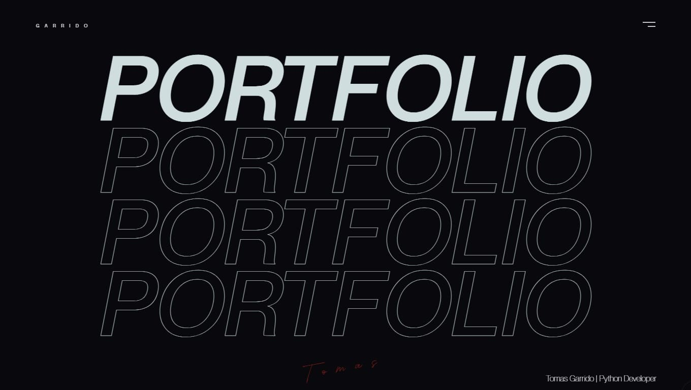
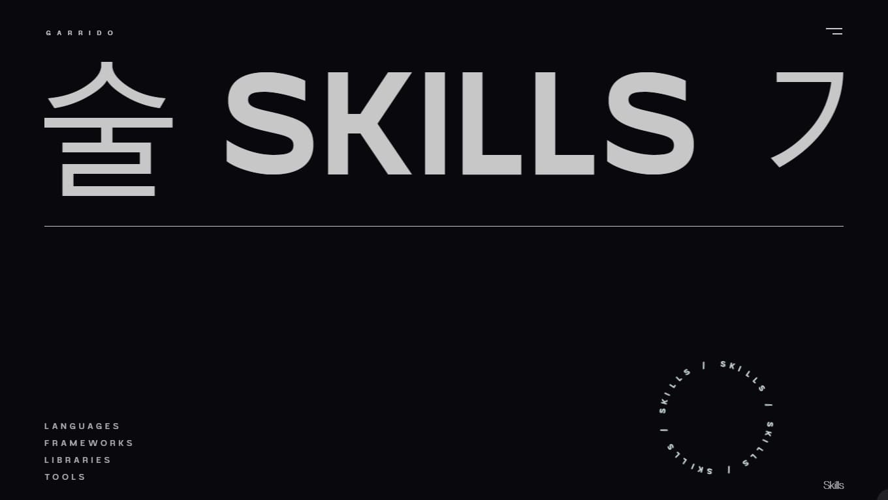
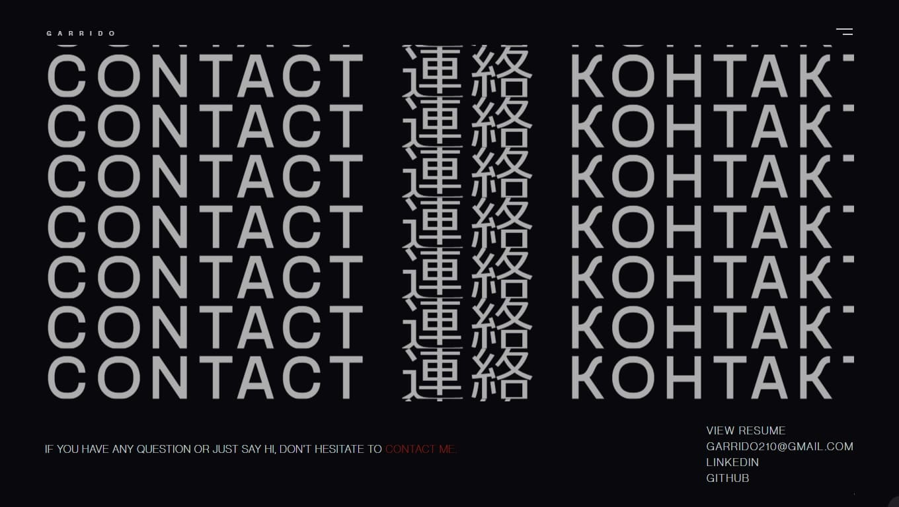

# Tomas Garrido - Web Developer

Welcome to my online portfolio! I'm Tomas Garrido, a Backend developer skilled in Python for web development, API, and data manipulation. This repository contains the source code for my portfolio website.

## Screenshots





## Technologies Used

- Flask
- HTML
- CSS
- JavaScript
- Gsap
- Bootstrap

## Key Features

- **Responsive Design:** My website is fully responsive, ensuring an optimal user experience on all devices.
- **Featured Projects:** I showcase some of my most prominent projects with direct links to their repositories and live demonstrations.
- **Mastered Technologies:** I list the technologies and tools I have mastered, highlighting my skills as a web developer.

## Installation and Usage

1. Clone this repository: 
```bash
git clone https://github.com/Garridot/tomasgarrido-.git
```
2. Install dependencies:

```bash  
pip install -r requirements.txt

```
3. Run the application:

```bash  
python run.py
```

## Contact

I am always open to new opportunities and collaborations! You can reach me via garridot210@gmail.com, or contact me on [LinkedIn](https://www.linkedin.com/in/tomas-garrido/).

---

Enjoy exploring my online portfolio! If you have any suggestions or comments, feel free to get in touch.